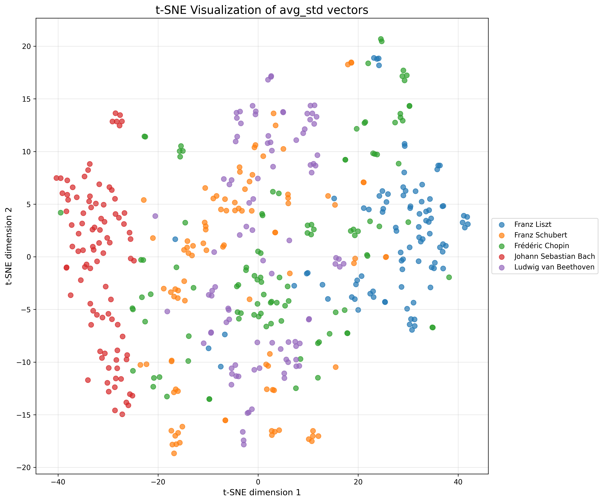
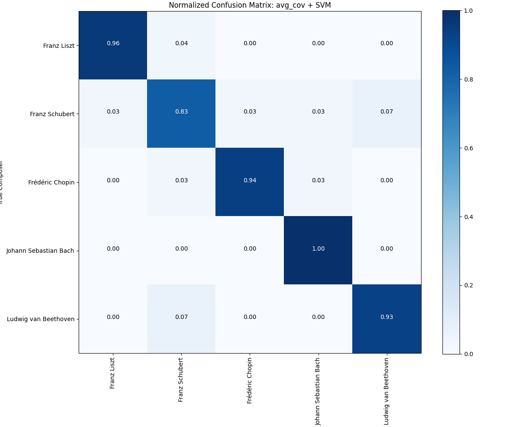
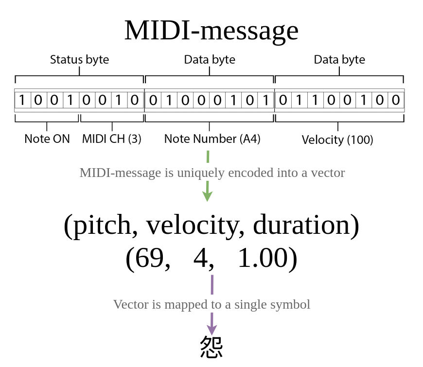
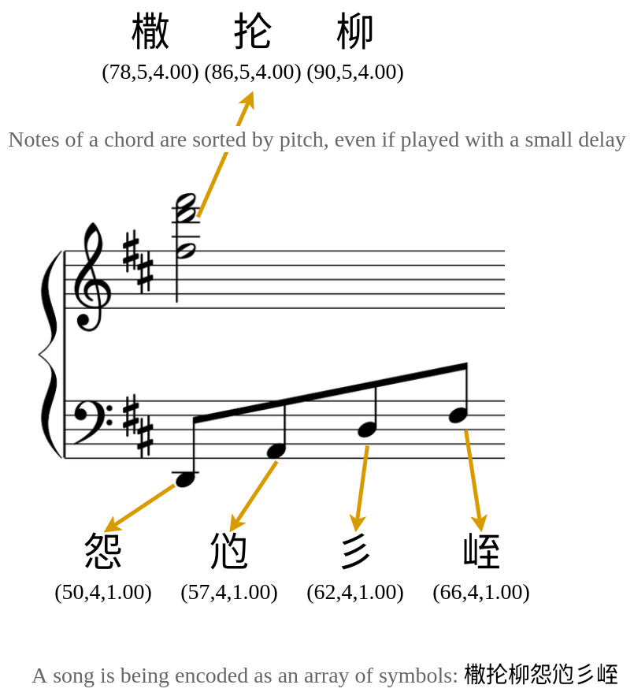
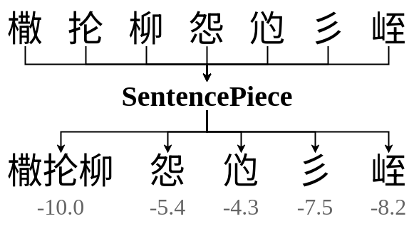
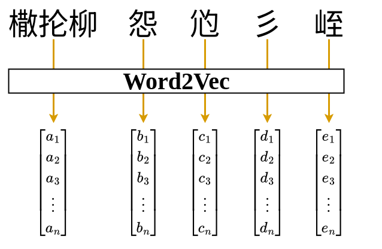
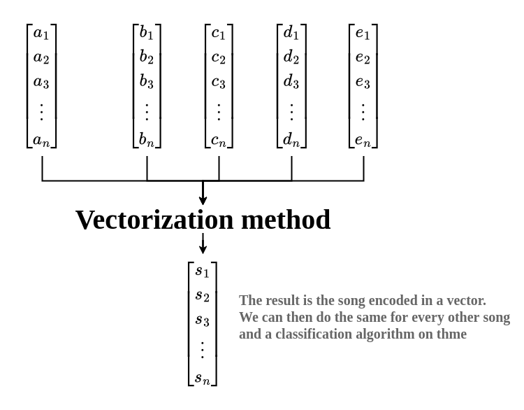

# music-nlp

_Work in progress_

_The project itself needs to be refactored, more features should be added._

## Abstract

The object of the study is the processing of the MIDI musical data.

The subject of research is the establishment of the NLP methods for the analysis and classification of the musical compositions.

The purpose of the work is to verify the assumption about the role of the fundamental characteristics of notes in shaping the unique composers’ style.

The work investigates the possibilities of applying NLP methods for musical data analysis with the purpose of classifying songs by composers. A method for processing MIDI files with subsequent creation of a dictionary of unique musical symbols has been developed. This method encodes fundamental note characteristics (pitch, dynamics, duration) as well as groups simultaneously played notes into chords.

A comprehensive analysis of five methods of vectorization of musical sequences is presented: averaging, standard deviation, combined method, TF-IDF and max pooling.
Using the Random Forest, SVM, KNN and Logistic Regression algorithms, the classification of musical works was performed. Based on the obtained results, it was determined that the combination method of averaging and standard deviation most effectively preserves both the original style of musical creativity and its internal variability.

The obtained results confirm the hypothesis about the influence of the fundamental characteristics of notes on the composers’ unique musical style and demonstrates the promising future of using NLP methods for analyzing musical data.

## Results

## Techniques used

### Note encoding

### Song encoding

### Tokenization and Vectorization

